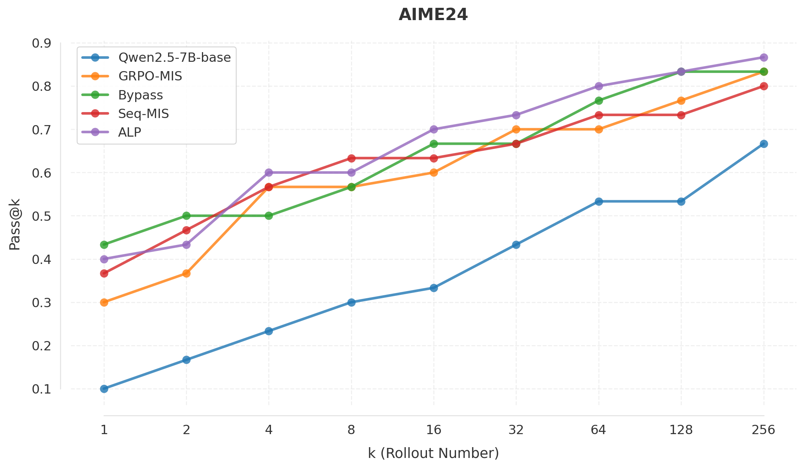
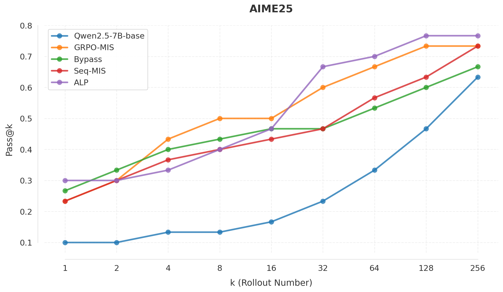

# Adaptive Layerwise Perturbation (ALP): Multi-Turn Experiments

**Chenlu Ye\*, Xuanchang Zhang\*, Yifan Hao, Zhou Yu, Ziji Zhang, Abhinav Gullapalli, Hao Chen, Jing Huang, Tong Zhang**

University of Illinois Urbana-Champaign, Amazon

[](https://arxiv.org/abs/2603.19470) [](https://beneficial-curiosity-d98.notion.site/Adaptive-Layerwise-Perturbation-Unifying-Off-Policy-Corrections-for-LLM-RL-304bb76884bb80038347d7479272ad8e)

---

## Introduction

Policy staleness and training-inference mismatch are key challenges in LLM reinforcement learning. Modern RL pipelines use separate systems for rollout generation (e.g., BF16 vLLM) and policy training (e.g., FP32 FSDP), introducing distributional gaps between the behavior policy and the training policy. These gaps destabilize training through inflated importance sampling ratios and noisy gradient estimates.

**Adaptive Layerwise Perturbation (ALP)** addresses this by injecting learnable Gaussian perturbations into transformer hidden states across all layers during policy updates. The perturbed policy serves as the importance sampling numerator against the unperturbed inference policy. By flattening the policy landscape through noise injection, ALP naturally reduces IS ratio tail behavior and maintains training stability. This repository contains **multi-turn tool-integrated reasoning experiments** using Qwen2.5-7B. Multi-turn training requires a sandbox service for code execution during rollout, as the agent interleaves natural language reasoning with executable code.

## Results

Multi-turn tool-integrated reasoning (Qwen2.5-7B base):

<p align="center">
  
  
</p>

| Method | Average Score |
|--------|---------------|
| Seq-ALP | **50.53** |
| Token-ALP | 49.62 |
| Token-MIS | 48.74 |
| Seq-MIS | 46.94 |
| Seq-Bypass | 46.66 |
| GSPO (baseline) | 46.57 |

### Ablation: Layer Range for ALP

| Layer Range | Score |
|-------------|-------|
| All layers (0-27) | **50.53** |
| Late layers (23-27) | 48.66 |
| Middle layers (12-17) | 48.51 |
| Early layers (0-5) | 48.25 |

All-layer perturbation substantially outperforms partial-layer variants, confirming that mismatch correction benefits from distributed noise across the full transformer stack.

## Method

<p align="center">
  
</p>

This codebase implements four rollout-correction strategies for LLM-RL:

- **GSPO (Baseline):** Group-level sequence policy optimization with no mismatch correction. Standard clipped importance ratio at the token level.
- **Seq-Bypass:** Uses rollout (vLLM) log-probabilities directly as old_log_probs in the loss denominator, bypassing the reference policy evaluation.
- **MIS/TIS (Masked Importance Sampling):** Computes an auxiliary IS ratio between the FSDP training policy and the vLLM rollout policy. Outlier ratios are masked or truncated to stabilize training.
- **ALP (Adaptive Layerwise Perturbation):** Injects learnable Gaussian perturbations $\delta \sim \mathcal{N}(0, \sigma^2 I)$ into transformer hidden states across all layers during policy updates. The perturbed policy serves as the IS numerator. The learnable $\sigma$ is a scalar coefficient per layer.

---

## Getting Started

### Prerequisites

- 8 H100 GPUs recommended
- Docker with GPU support (e.g. [NVIDIA Container Toolkit](https://docs.nvidia.com/datacenter/cloud-native/container-toolkit/install-guide.html))
- Sandbox service for code execution (the multi-turn agent executes code during training rollouts)
- (Optional) Add your user to the `docker` group so you can run Docker without `sudo`:
  ```bash
  sudo usermod -aG docker $USER
  newgrp docker
  ```
- Verify GPU access in a container:
  ```bash
  docker run --rm --gpus all nvidia/cuda:11.6.2-base-ubuntu20.04 nvidia-smi
  ```

### Build and Start Container

**Build the image** from the repository root:

```bash
cd REPO_ROOT
docker build -t verl_sandbox -f docker/Dockerfile.simpletir .
```

The Dockerfile uses base image `verlai/verl:app-verl0.5-transformers4.55.4-vllm0.10.0-mcore0.13.0-te2.2`. If your environment uses a different verl image, edit the `FROM` line in `docker/Dockerfile.simpletir` and rebuild.

**Start the container:**

Option A -- Simple (project mounted):

```bash
export REPO_ROOT=/path/to/multi-turn-mismatch   # path to this repo
export CONTAINER_NAME=multi_turn_mismatch      # any name you like

docker run -itd \
  --gpus all \
  --net=host \
  --ipc=host \
  --privileged \
  --shm-size=16g \
  --ulimit memlock=-1 \
  --ulimit stack=67108864 \
  --name "$CONTAINER_NAME" \
  -v "$REPO_ROOT":/workspace/project \
  -w /workspace/project \
  verl_sandbox \
  bash -c "tail -f /dev/null"
```

Option B -- Run as current user with dedicated Ray temp dir (recommended for shared machines):

```bash
export REPO_ROOT=/path/to/multi-turn-mismatch
export CONTAINER_NAME=multi_turn_mismatch
export RAY_TMPDIR_HOST=/path/to/ray_tmp

mkdir -p "$RAY_TMPDIR_HOST"
chmod 777 "$RAY_TMPDIR_HOST"

docker run -itd \
  --gpus all \
  --net=host \
  --ipc=host \
  --privileged \
  --shm-size=16g \
  --ulimit memlock=-1 \
  --ulimit stack=67108864 \
  --name "$CONTAINER_NAME" \
  --user $(id -u):$(id -g) \
  -v /etc/passwd:/etc/passwd:ro \
  -v /etc/group:/etc/group:ro \
  -v "$REPO_ROOT":/workspace/project \
  -v "$HOME":/home/$USER \
  -v "$RAY_TMPDIR_HOST":/tmp/ray \
  -e RAY_TMPDIR="$RAY_TMPDIR_HOST" \
  -e HOME=/home/$USER \
  -w /workspace/project \
  verl_sandbox \
  bash -c "tail -f /dev/null"
```

**Attach to the container:**

```bash
docker exec -it "$CONTAINER_NAME" bash
```

### Start Sandbox Service

The sandbox is required for multi-turn code execution during training. The agent generates Python code that must be executed in a sandboxed environment to produce tool outputs. Start the sandbox before running any experiments:

```bash
docker exec -d "$CONTAINER_NAME" bash -c \
  "cd /workspace/project/sandbox && uvicorn sandbox_api:app --host 0.0.0.0 --port 12345 --workers 8"
```

Verify the sandbox is running:

```bash
curl -X POST http://127.0.0.1:12345/faas/sandbox/ \
  -H 'Content-Type: application/json' \
  -d '{"code":"print(1+1)","language":"python","compile_timeout":1.0,"run_timeout":3.0}'
```

Expected: JSON with `"status":"success"` and `"stdout":"2\n"`. See `sandbox/README.md` for additional sandbox configuration options.

---

## Running Experiments

Each experiment type has a dedicated training script at the repository root:

```bash
# Set required environment variables
export WANDB_API_KEY="your-key"
export WANDB_ENTITY="your-entity"
export DATA_PATH="./datasets"
export CHECKPOINT_PATH="./checkpoints"
export MODEL_DIR="./models"       # parent dir of HF model checkpoints

# GSPO baseline
bash train_gspo.sh

# TIS/MIS
bash train_mis.sh

# ALP (perturbation)
bash train_perturb.sh
```

Or use `train.sh` directly with arguments:

```bash
MODEL_PATH=Qwen \
DATA_PATH=./datasets \
CHECKPOINT_PATH=./checkpoints \
LOG_PATH=./logs/TIR \
NNODES=1 \
GPUS_PER_NODE=8 \
RESUME=False \
CONFIG_NAME=simpletir_trainer \
bash train.sh \
  --max_response_length 8000 \
  --max_prompt_length 16000 \
  --model_name Qwen2.5-7B \
  --max_turns 5 \
  --train_batch_size 128 \
  --val_sample_size 50 \
  --n_val 32 \
  --train_dataset "simplelr_math_35/train deepscaler/train"
```

### Environment Variables

| Variable | Description | Default |
|----------|-------------|---------|
| `CUDA_VISIBLE_DEVICES` | GPU IDs (comma-separated) | Must be set by environment |
| `DATA_PATH` | Directory containing dataset subdirs | `./datasets` |
| `CHECKPOINT_PATH` | Directory to save checkpoints | `./checkpoints` |
| `MODEL_DIR` | Parent directory for HF model checkpoints | `./models` |
| `MODEL_PATH` | HuggingFace org for model download | `Qwen` |
| `SANDBOX_ENDPOINT` | Sandbox API endpoint URL | `http://127.0.0.1:12345/faas/sandbox/` |
| `PROJECT_NAME` | Project name for experiment naming | `TIR` |
| `CONFIG_NAME` | Config file name (without extension) | `simpletir_trainer` |
| `WANDB_API_KEY` | WandB API key (enables wandb logging) | Optional |
| `WANDB_ENTITY` | WandB entity | Optional |
| `RAY_TMPDIR` | Ray temp directory | Optional |

---

## ALP Configuration

### Key Parameters

The `train_perturb.sh` script configures ALP with the following parameters (also settable via Hydra overrides):

| Parameter | Config Key | Description | Default |
|-----------|-----------|-------------|---------|
| `USE_PERTURBATION` | `actor_rollout_ref.actor.use_perturbation` | Enable/disable ALP perturbation | `True` |
| `PERTURB_STD` | `actor_rollout_ref.actor.perturb_std` | Initial standard deviation $\sigma_0$ for Gaussian noise. The actual noise scale is $\exp(\log(\sigma_0))$, optimized in log-space to stay non-negative. | `1e-8` |
| `coef_learnable` | `coef_learnable` (in model `config.json`) | If `True`, the per-layer noise coefficient $\sigma_l$ is a learnable `nn.Parameter` updated via gradient descent. If `False`, $\sigma_l$ is fixed at `perturb_std`. | `True` |
| `PERTURB_LR` | `actor_rollout_ref.actor.perturb_lr` | Learning rate for the learnable perturbation coefficients (only used when `coef_learnable=True`) | `1e-2` |
| `PERTURB_START_LAYER` | `actor_rollout_ref.actor.perturb_start_layer` | Start layer index for perturbation (inclusive) | `0` |
| `PERTURB_END_LAYER` | `actor_rollout_ref.actor.perturb_end_layer` | End layer index for perturbation (exclusive). `null` means through the last layer. | `null` |
| `LOSS_MODE` | `actor_rollout_ref.actor.policy_loss.loss_mode` | Loss aggregation: `token` (token-level ALP), `sequence` (sequence-level ALP), `vanilla`, `cum-token` | `sequence` |

#### Enabling Learnable Coefficients

To use learnable perturbation coefficients, add these fields to the model's `config.json` before training:

```json
{
  "use_perturbation": true,
  "coef_learnable": true,
  "perturb_std": 1e-2
}
```

### Model Patch Selection (`PERTURB_PATCH`)

ALP works by monkey-patching the transformer's decoder layer to inject noise before the attention block. Different model architectures require different patches. Set the `PERTURB_PATCH` environment variable **before** launching training:

```bash
export PERTURB_PATCH=qwen2   # For Qwen2 / Qwen2.5 models (default)
export PERTURB_PATCH=qwen3   # For Qwen3 models
export PERTURB_PATCH=llama   # For LLaMA models
```

| Patch | Supported Models | Patch File |
|-------|-----------------|------------|
| `qwen2` | Qwen2, Qwen2.5, Qwen2.5-7B | `verl/trainer/perturb_transformer/patch_qwen2.py` |
| `qwen3` | Qwen3 | `verl/trainer/perturb_transformer/patch_qwen3.py` |
| `llama` | LLaMA 3, LLaMA 3.1, LLaMA 3.2 | `verl/trainer/perturb_transformer/patch_llama.py` |

The patch is applied in two places:
1. **Main trainer process** (`verl/trainer/main_ppo.py`): applies the patch at import time
2. **FSDP worker processes** (`verl/workers/fsdp_workers.py`): each Ray worker applies the same patch, selected via the `PERTURB_PATCH` environment variable propagated through Ray's runtime environment

### Noise Seed Mechanism

The perturbation patch uses a **stateless seeded Generator** to ensure gradient-checkpointing correctness. Before every forward pass, a deterministic seed is set on each decoder layer (`layer._noise_seed`). During the forward pass, a local `torch.Generator` is created with `seed = _noise_seed + layer_idx`, producing identical noise on both the original forward and gradient-checkpoint recomputation. This guarantees correct gradients when `enable_gradient_checkpointing=True`.

For learnable coefficients, the noise injection is additionally wrapped in `torch.utils.checkpoint.checkpoint()` to avoid storing full-size noise activations while still computing gradients for the coefficient.

---

## Dataset

Multi-turn training uses [SimpleRL Math 3.5](https://huggingface.co/datasets/simplelr_math_35) and [Deepscaler](https://huggingface.co/datasets/agentica-org/DeepScaleR) datasets. Place the parquet files under `$DATA_PATH` following this structure:

```
$DATA_PATH/
  simplelr_math_35/
    train/    # training split parquet files
    test/     # evaluation split
  deepscaler/
    train/    # training split
    aime/     # AIME evaluation
    aime25/   # AIME 2025 evaluation
```

---

## Evaluation

Convert a trained checkpoint to HuggingFace format, then evaluate:

```bash
# Convert checkpoint
bash scripts/model_merger.sh

# Evaluate on AIME
MODEL_PATH=./models \
DATA_PATH=./datasets \
CHECKPOINT_PATH=./checkpoints \
LOG_PATH=./logs/TIR \
NNODES=1 \
GPUS_PER_NODE=8 \
RESUME=False \
CONFIG_NAME=simpletir_trainer \
bash train.sh \
  --max_response_length 12000 \
  --max_prompt_length 36000 \
  --model_name <MODEL_NAME> \
  --max_turns 10 \
  --valid_dataset "deepscaler/aime" \
  --val_only True \
  --n_val 32 \
  --output_acc_to_file True \
  --val_sample_size 500 \
  --sp_size 2
```

---

## Citation

If you find this work useful, please cite our paper:

```bibtex
@article{ye2025adaptive,
  title={Adaptive Layerwise Perturbation: Unifying Off-Policy Corrections for LLM Reinforcement Learning},
  author={Ye, Chenlu and Zhang, Xuanchang and Hao, Yifan and Yu, Zhou and Zhang, Ziji and Gullapalli, Abhinav and Chen, Hao and Huang, Jing and Zhang, Tong},
  journal={arXiv preprint arXiv:2603.19470},
  year={2025}
}
```

## Acknowledgement

This codebase is built upon [SimpleTIR](https://github.com/ltzheng/SimpleTIR). We thank the SimpleTIR team for their multi-turn RL infrastructure.
